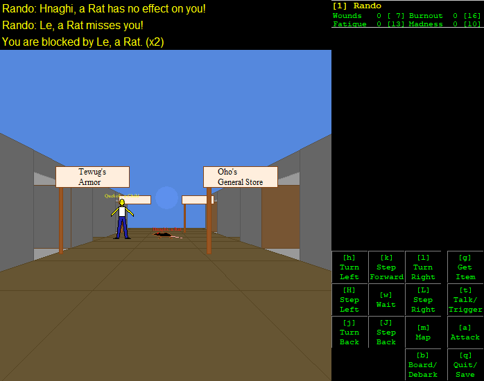
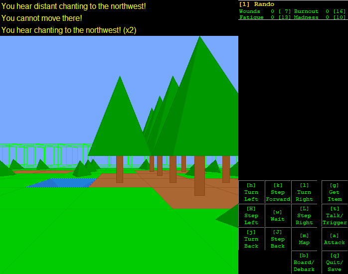

# Umbra

**_Umbra_** is an open-source computer RPG developed by
[Mark Hughes](https://mdhughes.tech/)
in 2001&ndash;2002.
This is an unofficial Python 3 port of the Python 2.1 source code.

## Screenshots

## Description

From the
[game's page](https://mdhughes.tech/software/umbra/):

> The world is randomly-generated for new play every time, but there is an eventual goal and storyline. It was heavily influenced by roguelike games, Alternate Reality, console RPGs, and the works of H.P. Lovecraft and Clark Ashton Smith.

> Umbra is set after a Lovecraftian apocalypse – the ancient god Mogth has risen from ages of deathlike slumber, conquered the world, thrown down civilization, and now man huddles in primitive communities, scattered and dying out. You play a band of heroes who will attempt to free humanity!

## System requirements

Python 3.8 or later.
Earlier versions of Python 3 may work but are not supported.
GUI is optional.
Unusually for a game,
_Umbra_ can run either with first-person [Tkinter](https://docs.python.org/3/library/tkinter.html) graphics
or in text mode.

This port has been lightly tested on

- Debian 12
- NetBSD 9.3
- Ubuntu 22.04
- Windows 10

## Installation

1. Install Python 3.8 or later.
2. Clone this repository.
3. On \*BSD, Linux, and Mac, run `umbra.sh` to play in graphics mode; on Windows, run `umbra.cmd`.
Run `umbra.sh --text` or `umbra.cmd --text` respectively for text mode.

## Documentation

For the original documentation see [`docs/README.html`](docs/README.html).

## License

zlib.
See [`license.txt`](license.txt).
